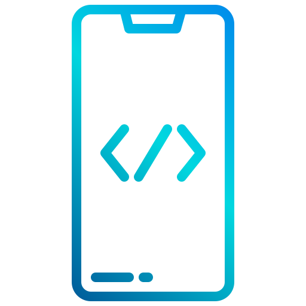
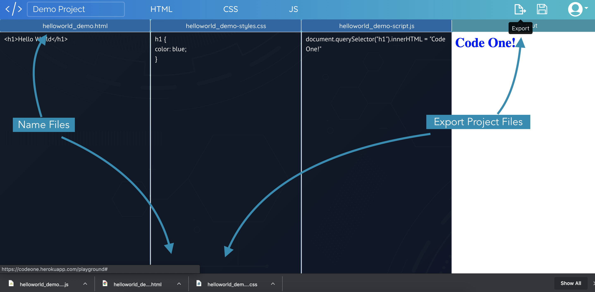
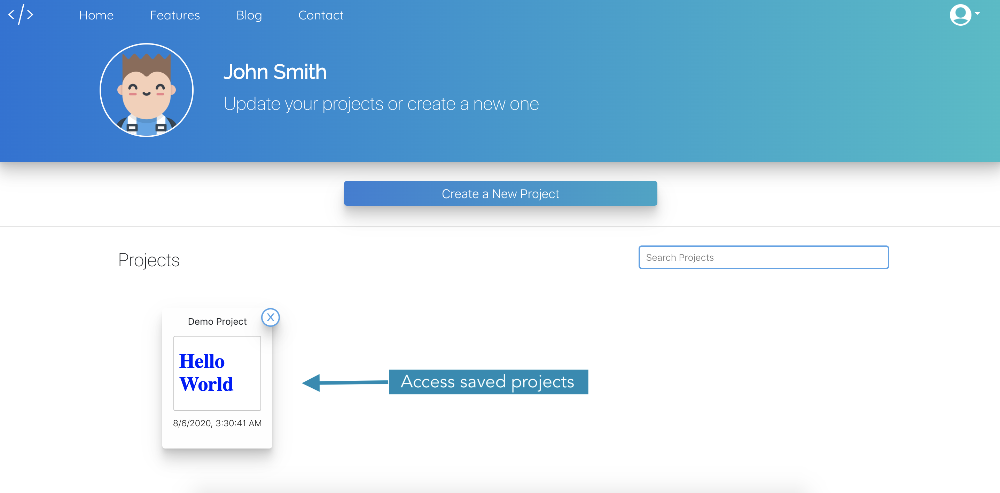

## [Code One](https://codeone.herokuapp.com/)

**Design, build, and test your front end projects in our online playground.
Develop with HTML, CSS, and JS and watch your projects come to life alongside your code!
This web application was intended to optimize and simplify front end development by providing immediate visual feedback along with other useful tools.**

**This project was hosted on [Heroku](https://www.heroku.com/) and bootstrapped with [Create React App](https://github.com/facebook/create-react-app).**

## Installation

In the project directory, you can run:

### `yarn start`

Runs the app in the development mode. 
Open [http://localhost:3000](http://localhost:3000) to view it in the browser.

The page will reload if you make edits. 
You will also see any lint errors in the console.

### `yarn test`

Launches the test runner in the interactive watch mode. 
End-to-end tests are written with Puppeteer and Jest in [Tests](./tests)

### `npm run build`

Builds the app for production to the `build` folder. 
It correctly bundles React in production mode and optimizes the build for the best performance.

The build is minified and the filenames include the hashes. 
Your app is ready to be deployed!

See the section about [deployment](https://facebook.github.io/create-react-app/docs/deployment) for more information.

### `npm run eject`

**Note: this is a one-way operation. Once you `eject`, you can’t go back!**

If you aren’t satisfied with the build tool and configuration choices, you can `eject` at any time. This command will remove the single build dependency from your project.

Instead, it will copy all the configuration files and the transitive dependencies (webpack, Babel, ESLint, etc) right into your project so you have full control over them. All of the commands except `eject` will still work, but they will point to the copied scripts so you can tweak them. At this point you’re on your own.

You don’t have to ever use `eject`. The curated feature set is suitable for small and middle deployments, and you shouldn’t feel obligated to use this feature. However we understand that this tool wouldn’t be useful if you couldn’t customize it when you are ready for it.

## Usage

## Contribution
Project created by Diva Lei.

## Related Projects

[Code Pen](https://codepen.io/pen/)

## Learn More

You can learn more in the [Create React App documentation](https://facebook.github.io/create-react-app/docs/getting-started).

To learn React, check out the [React documentation](https://reactjs.org/).

### Code Splitting

https://facebook.github.io/create-react-app/docs/code-splitting

### Analyzing the Bundle Size

https://facebook.github.io/create-react-app/docs/analyzing-the-bundle-size

### Making a Progressive Web App

https://facebook.github.io/create-react-app/docs/making-a-progressive-web-app

### Advanced Configuration

https://facebook.github.io/create-react-app/docs/advanced-configuration

### Deployment

https://facebook.github.io/create-react-app/docs/deployment

## Licensing
This project is licensed under the terms of the MIT license.
